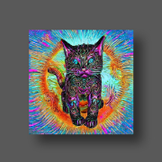
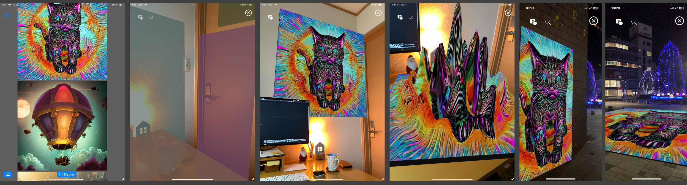
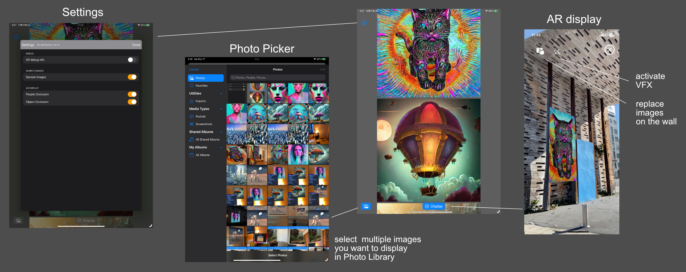

# iOS app - AR Wall Picture

An iOS app that displays images from your Photo Library on the wall in AR.

- Target: iPhone / iOS 16.0+, iPad / iPadOS 16.0+
- Build: macOS 13.1+, Xcode 14.2+

An iOS app in a separate project repo allows you to generate images using Stable Diffusion
on your devices and save them to your Photo Library.
Let's appreciate them in AR with this iOS app.

- GitHub repo of the iOS app - AR Diffusion Museum: https://github.com/ynagatomo/ARDiffMuseum

From this project you can see:

- ARKit: plane detection and displaying the planes
- RealityKit: dynamic image-texture replacement and using a custom material (Metal Shader)
- PhotoKit: PhotoPicker (new in iOS 16)

## Change Log

none

## Features

1. selecting images from Photo Library
1. detecting virtual or horizontal planes in AR
1. displaying images in AR and automatic image switching based on viewing angle
1. showing visual effects on the images in AR
1. built-in sample images

## UI

This project provides a minimal UI. Feel free to extend it as you like and create your own app.

## Consideration

### Visual Effects

The app uses a simple Metal Shader to provide a visual effect.
Please modify it as you like.

### Creating a picture-frame

The app uses a simple picture frame.
As this project contains the Blender file of the picture frame,
you can modify it.

1. modify or create your picture frame with Blender
1. convert it to USDZ with Reality Converter
1. replace or add it to the Project
1. edit the `AppConstant.swift` to name it if needed

- Blender file: `assets/panel1_1.blend`

## References

none

